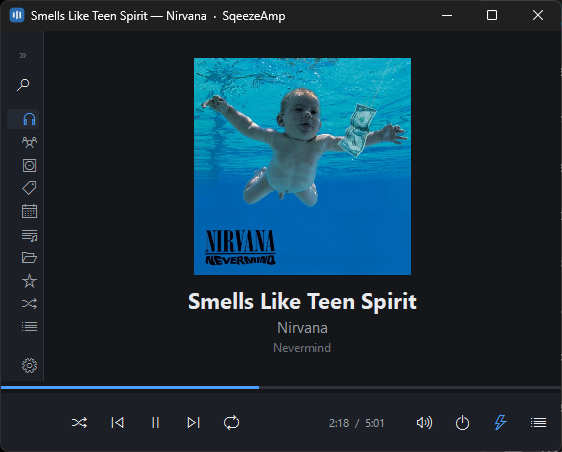

# SqeezeAmp

[](https://github.com/kvit-s/sqeezeamp/actions/workflows/ci.yml)

A native Windows player for [Lyrion Music Server](https://lyrion.org) (LMS,
formerly Logitech Media Server). One Qt 6 / C++20 application that registers
itself as a SqueezeBox player, browses your library, and plays to a local audio
device — with a real desktop UI rather than the server's web skin in a browser
control.



**It controls exactly one player: itself.** Other players on your server —
hardware Squeezeboxes, other squeezelite instances, bridges — are not listed,
not selectable, and not controllable. This is a music player for this PC, not a
remote control for the house.

**Status: it works, and it is not finished being checked.** It browses, queues
and plays against a real server, and the protocol, reconciliation and engine
seams are covered by tests. Most of the Windows integration — tray, media keys,
SMTC, taskbar buttons — is built but has not been exercised by hand, and the
long-running behaviour (a 12-hour soak, a server restart, a DAC unplugged
mid-track) has code and no evidence. Treat it as a working beta rather than a
finished product.

**Scope, in one paragraph.** My Music only: no plugins, no radio, no podcasts,
no favourites — with one deliberate exception, the server's own Random Mix. One
player, itself, with no switcher and no sync groups. No network control surface
of any kind. Audio through the shared Windows mixer so everything else stays
audible. These are decisions rather than gaps, and
[`CONTRIBUTING.md`](CONTRIBUTING.md) explains each one and what would have to
change to reopen it.

---

## What you need

| | |
|---|---|
| **Windows 10/11 x64** | The only supported target. The code stays portable, but nothing else is built or tested. |
| **Qt 6.10.1, `msvc2022_64`** | Modules: Core, Gui, Quick, QuickControls2, Widgets, Network, Concurrent, Test, QuickTest. |
| **Visual Studio 2022** | Community is fine. The build uses the CMake that ships inside it. |
| **Python 3** | Optional. Only used by the `LayeringGuard` test; without it that one test is skipped with a warning. |
| **A running LMS** | Anywhere on your network. Developed against Lyrion 9.1.0 running as a Home Assistant add-on. |
| **`squeezelite.exe`** | Not included — see [The audio engine](#the-audio-engine) below. Without it the app builds, runs and browses, but will not play. |

Both toolchain paths can be overridden in the environment if yours differ:

```bat
set QT_ROOT_DIR=C:\Qt\6.10.1\msvc2022_64
set VS_CMAKE_DIR=C:\Program Files\Microsoft Visual Studio\2022\Community\Common7\IDE\CommonExtensions\Microsoft\CMake\CMake\bin
```

## Build

From a normal `cmd` prompt at the repository root — no Developer Command
Prompt needed, the scripts find the toolchain themselves:

```bat
win-build.bat                 :: configure + build (Release)
win-build.bat configure       :: configure only
win-build.bat build           :: build only, skipping the configure step
```

Output lands in `build-windows-msvc-release\Release\sqeezeamp.exe`.

> **Close the app before rebuilding.** A locked `sqeezeamp.exe` fails its link
> with `LNK1104` while everything else succeeds, which leaves a stale
> executable that looks freshly built.

## Test

```bat
win-test.bat                  :: everything, output to win-test-result.txt
```

**Read `win-test-result.txt`, not the console.** Piping ctest through another
process leaves stdout fully buffered, so output vanishes on a crash and
phantom failures appear.

Two labels, both run by the script:

- **`unit`** — deterministic. No display, no network, no child processes.
  Covers the protocol vocabulary, reply parsing, the engine's command line and
  log scraping, and the two rules that matter most: that no request can escape
  with another player's id, and that the server wins a conflict within 500 ms.
- **`shell`** — needs a QML engine and a window. Loads the real `Main.qml`
  through the real composition root with the session and the audio engine
  switched off, and instantiates every view.

To run one label, or one test, call `ctest` directly — it lives in
`%VS_CMAKE_DIR%` beside the CMake the build uses, and needs `%QT_ROOT_DIR%\bin`
on `PATH` so the test binaries find their Qt DLLs:

```bat
set PATH=%QT_ROOT_DIR%\bin;%PATH%
ctest --test-dir build-windows-msvc-release -C Release -L unit --output-on-failure
ctest --test-dir build-windows-msvc-release -C Release -R LmsSessionTests -V
```

## Run

Run `win-deploy.bat` **once** after the first build — it copies the Qt runtime
next to the executable, without which nothing starts — then:

```bat
win-deploy.bat
build-windows-msvc-release\Release\sqeezeamp.exe
```

You only need to repeat the deploy step when the Qt version or the audio engine
changes; ordinary rebuilds just overwrite `sqeezeamp.exe` in place.

### First run

The app starts with **no server configured** and says so in a banner under the
title bar. Open **Settings** in the left rail and type your server's host and
port (default `9000`).

**Discovery will probably find nothing, and that is normal.** It broadcasts on
UDP 3483, and a broadcast does not cross a router — so a server on another
subnet, which includes any LMS running as a Home Assistant add-on, has to be
typed in. Auth is optional; if your server needs it, the password goes to the
Windows Credential Manager and never into the settings.

Once connected the app registers itself as a player. It appears in your
server's player list under whatever name is set in **Settings → Player**,
defaulting to `SqeezeAmp (<your-machine>)`, and it keeps the same identity
across restarts — so its queue and per-player settings survive on the server.

### Command line

```
sqeezeamp.exe --minimized     start hidden in the system tray

sqeezeamp.exe --play-pause    hand a transport command to the running copy
sqeezeamp.exe --next          and exit; does nothing if none is running
sqeezeamp.exe --previous
sqeezeamp.exe --stop
```

`--minimized` is what the "Start with Windows" setting writes into the Run key.
`--help` and `--version` are accepted but answer in a **message box** rather
than on stdout: this is a GUI-subsystem binary with no console attached, so Qt
has nowhere else to put them.

A second launch does not start a second copy: it raises the window of the one
already running and exits. The transport flags use that same mechanism — see
*Driving it from a script* below.

### Driving it from a script

For a keyboard whose keys can be remapped but which has no media keys — a
Microsoft Sculpt, say — a remapped key can run `sqeezeamp.exe --next`.

Launching a process per keypress costs a few hundred milliseconds of Qt
start-up, so `tools/sqz-remote.au3` talks to the running app directly instead:

```
sqz-remote.au3 next          also: previous, playpause, stop, activate
```

Both routes end at the same place — the single-instance named pipe,
`\\.\pipe\SqeezeAmp-instance-<username>`, which accepts those five verbs and
ignores everything else. It is the app's only listening endpoint and it is
**not** a socket, which is what keeps the no-remote-control rule intact. Two
consequences worth knowing:

- The pipe is per-user, so anything running as you can send a verb. That is the
  same trust boundary as you pressing a media key, and it is the whole of the
  surface: verbs only, nothing readable, no player id, no queries.
- It reaches **this** app specifically. Unlike a media key, which whichever
  player grabbed the hotkey first will answer, this cannot go to the wrong one.

### Keyboard

| | |
|---|---|
| <kbd>Space</kbd> | Play / pause |
| <kbd>←</kbd> <kbd>→</kbd> | Seek ∓5 s |
| <kbd>Ctrl</kbd>+<kbd>←</kbd> <kbd>→</kbd> | Previous / next track |
| <kbd>↑</kbd> <kbd>↓</kbd> | Volume |
| <kbd>Ctrl</kbd>+<kbd>F</kbd> | Search |
| <kbd>Ctrl</kbd>+<kbd>U</kbd> | Queue |
| <kbd>Ctrl</kbd>+<kbd>M</kbd> | Mini player |
| <kbd>Ctrl</kbd>+<kbd>,</kbd> | Settings |
| <kbd>Esc</kbd> | Close the lyrics, or go back |

The four media keys work globally, whether or not the window has focus.

### Lyrics

Click the cover on Now Playing. The server serves whatever plain lyric tag the
file carries, which is enough to read but not to follow.

For lyrics that follow the song, point **Settings → Music folder on this PC**
at the same music the server is playing — a mapped drive, a UNC share, a local
folder. SqeezeAmp then looks for an `.lrc` beside each track and highlights the
line being sung. Lyrion does not read those files itself, which is why this is
the client's job and why the setting exists at all.

Left empty, nothing is read from disk and the pane shows the server's copy.
A sheet with no timings is drawn with **no line highlighted**: where the file
does not say, the app does not guess.

### Where it keeps things

| | |
|---|---|
| Settings | `HKCU\Software\SqeezeAmp\SqeezeAmp` |
| Password | Windows Credential Manager, under `SqeezeAmp/<host>:<port>` |
| Logs | `%LOCALAPPDATA%\SqeezeAmp\SqeezeAmp\logs\` — 2 MB × 5 generations |
| Artwork cache | `%LOCALAPPDATA%\SqeezeAmp\SqeezeAmp\cache\artwork\` — bounded, default 256 MB |

Closing the window keeps the player running in the tray. Quit from the tray
menu to actually stop it.

## The audio engine

SqeezeAmp does not decode anything itself. It supervises a **stock, unmodified
`squeezelite.exe`** as a child process and talks to it only through documented
command-line arguments and its log output. That binary is GPLv3, is
deliberately **not** committed to this repository, and is **not distributed
with SqeezeAmp**: the installer downloads it from upstream during setup, and
the portable zip carries `fetch-engine.ps1`, which does the same when you run
it.

For a development build, get one the same way:

```bat
powershell -ExecutionPolicy Bypass -File packaging\windows\fetch-engine.ps1 -DestDir packaging\windows
win-deploy.bat
```

Or put your own copy at `packaging\windows\squeezelite.exe` (gitignored), or
point `SQZ_ENGINE_EXE` at it. Either way `win-deploy.bat` stages it into
`engine\` beside the application so the tree runs from Explorer, and
`win-package.bat` then removes it, because neither shipped artifact may carry
it.

**Where it is downloaded from is not baked into the installer.** It comes from
[`packaging/engine-manifest.txt`](packaging/engine-manifest.txt), read over the
network from this repository, because upstream keeps only a rolling window of
Windows builds on
[SourceForge](https://sourceforge.net/projects/lmsclients/files/squeezelite/windows/)
and prunes the rest — the build this project first pinned is already gone from
there. Editing that one file repairs installers that have already shipped,
without a new release. A failed download is never a failed install: setup
completes, and the app reports that no engine is present and names the script
that fetches one.

The version that was tested, with its checksum, is pinned in
[`packaging/engine-version.txt`](packaging/engine-version.txt). Treat an engine
upgrade as a change with a test pass behind it: `ExternalEngine::applyLogLine()`
scrapes a log format that upstream makes no promises about, and
`ExternalEngineTests` holds lines captured from the pinned build so a change
shows up as a red test rather than as an empty diagnostics panel.

Audio plays through the **shared** Windows mixer by design, so other
applications stay audible and Windows handles any sample-rate conversion. An
exclusive-mode toggle exists in Settings; turning it on silences every other
application on the PC.

## Package

```bat
win-deploy.bat                :: stage Qt, the audio engine and the licences
win-package.bat               :: portable zip + installer  → dist\
win-package.bat zip           :: portable zip only
```

`win-deploy.bat` runs `windeployqt` and copies the engine and the licence files
into the build output, which is also what makes the executable runnable from
Explorer. `win-package.bat` then builds:

- `dist\SqeezeAmp-<version>-windows-x64-portable.zip`
- `dist\SqeezeAmp-<version>-setup.exe`, if
  [Inno Setup 6](https://jrsoftware.org/isinfo.php) is installed — otherwise it
  builds the zip and says so.

Both come from the same staged tree, so what ships is what you ran.

## Layout

```
src/protocol/   pure LMS protocol — requests, replies, the command vocabulary
src/session/    the live connection; the only module that links Qt Network
src/engine/     the audio engine behind IAudioEngine; the only module with QProcess
src/app/        orchestration and the QML-facing models
src/qml/        QML type registrations, the composition root, Windows integration
qml/            the shell's .qml files, shipped via resources.qrc
tests/          Qt Test; the `unit` and `shell` labels
tools/          check-layering.py — the module graph, enforced
```

Includes only ever point downward, and three ownership rules that the compiler
cannot express are enforced by `tools/check-layering.py`, which runs as a test.
[`CONTRIBUTING.md`](CONTRIBUTING.md) is the working guide: the settled scope,
the invariants, the traps, and where a new file goes.

## Licensing

**SqeezeAmp is [MPL-2.0](LICENSE).** The licence covers every file in this
repository; source files carry an `SPDX-License-Identifier: MPL-2.0` line, and
MPL Exhibit A's `LICENSE`-file fallback covers the few that do not (the build
scripts, the packaging inputs, and the documents).

MPL is file-level copyleft: a Larger Work built around these files can carry
whatever terms you like, but modifications to *these* files stay under MPL. That
is deliberate. The complaint this project was started over is a player UI
nobody can fix, extend or theme; this is the licence that makes sure this one
never becomes that.

Exhibit B, the "Incompatible With Secondary Licenses" notice, is **not** used
anywhere and must not be added. Without it, MPL-2.0 §3.3 lets these files also
be distributed under a Secondary License — GPLv2-or-later, LGPLv2.1-or-later or
AGPLv3 — when combined with a work governed by one. That is what keeps an
otherwise awkward question academic rather than risky: whether supervising a
GPLv3 `squeezelite.exe` as a child process makes one work or two has no settled
answer, and if it were ever held to be one work, the combination can simply be
distributed under GPLv3.

The rest:

- The `squeezelite.exe` SqeezeAmp drives is **GPLv3**, and SqeezeAmp does not
  distribute it — the installer fetches it from upstream, so there is no
  corresponding source to attach to a release and no written offer to make.
  Its licence text ships anyway (`packaging/licenses/`, and `CMakeLists.txt`
  refuses to configure without it), so a user whose installer fetched the
  engine has its terms on disk.
- Qt is used under **LGPLv3**, which is why the Qt libraries ship as separate
  DLLs and are never linked statically: you must be able to relink against your
  own Qt build.
- A build that never leaves the machine that produced it owes none of this.
  GPLv3's obligations attach to distribution, not to use.

See [`THIRD-PARTY-NOTICES.md`](THIRD-PARTY-NOTICES.md) for the full picture,
including what is statically linked inside the engine binary.
